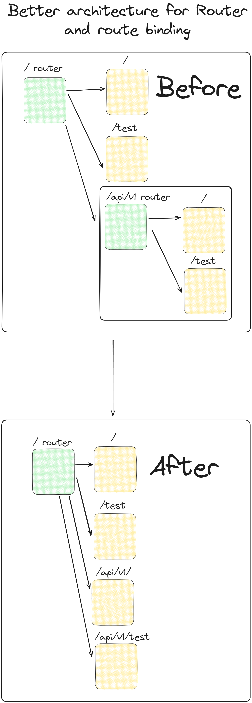

# My Own Web Server and Router
Built in Deno

This is a basic project where I explore how web servers work. 
What I hope to learn:
* Ins and Outs of HTTP
  - What are the various HTTP Headers and how do I use them
  - How do I use HTTP
* Understanding what a web server is and it how serves data to users
  - How do I server content through different paths
  - What is inside a request body and how do I react accordingly to that request body?
* What it's like to work in Deno

How to run web server(in terminal):
```
deno task dev
```

Running server with router
```
deno task dev:server
```

# Update 7/28/2023
Implemented my own basic router. Check out `router.ts`.
Currently I do not support the ability to have dynamic routes but I plan on fixing that later.

What I have so far:
* The ability to set handlers for pre-determined routes
* The ability to bind subrouters to specific paths
* Automatic Query Param parsing thanks to `URLSearchParams`

What I want to add:
* Support for dynamic routes (i.e. '/:id')
  - I'd most likely change the params object to have slugs **and** the queryParams

# Update 8/3/2023
Big Change to the Router:
* Router now supports adding and resolving dynamic route. A dynamic route is
indicated by `:`
* Modified function signature to add support for accessing the slug from dynamic route resolving in resolver
``` ts
function (
	req: Request,
	data: { slug: Record<string, string>; params: URLSearchParams }
) : Response
```
* Any data caught by a dynamic route will be be sent through the slug field in the data paramater
* Different method to handling route binding.
  * In essence, instead of keeping track of an internal map of subrouters it would be better to just adding the handlers to the router the subrouter is binding to. (look at the image below for a visual example) 
  
  
* `add` now requires adding the HTTP method as a parameter.
  * Also added `get`, `post`, `patch`, `delete` functions that just call `add` and passes in their respective HTTP method


